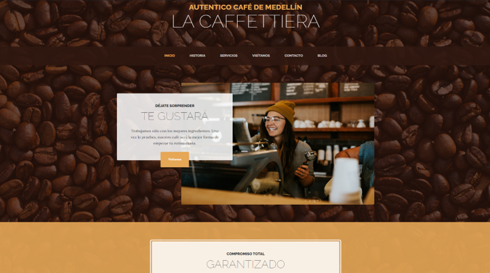
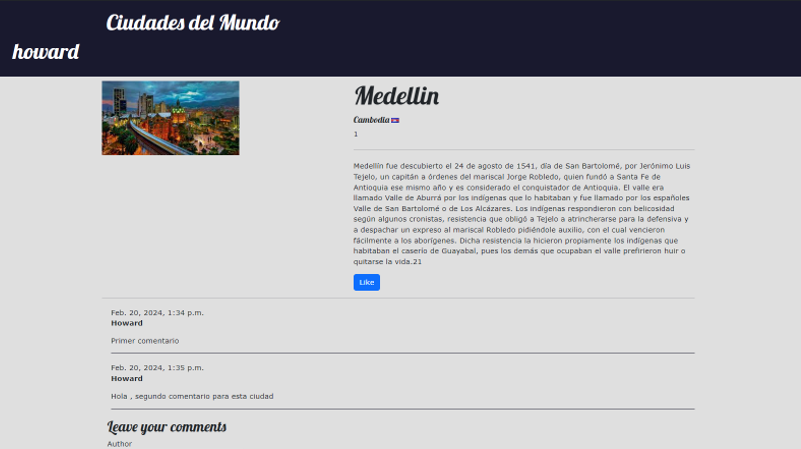

<!--  <h2> Hola, soy <a href="https://www.linkedin.com/in/plinio-isidro-mosquera/" target="blank" rel="noreferrer"> Plinio🤚 </h2>-->

  

Soy desarrollador backend apasionado por la tecnología, actualmente estudiante de Ingeniería Informática en UNIR. Me enfoco en construir soluciones web eficientes, escalables y seguras usando tecnologías como Java, Spring Boot, Python, SQL  y Django.  

✅ Experiencia desarrollando plataformas transaccionales de alto tráfico  
✅ Integración de APIs RESTful y microservicios  
✅ Bases de datos: PostgreSQL, MySQL, Oracle  
✅ Control de versiones con Git y metodologías ágiles (Scrum)

<!-- contacto -->

  ## 📩 Contactame
  ¡No lo dudes! El café corre por mi cuenta ☕.
  

  
<!-- 

  
        
      

 --> 

<!-- habilidades tectnica -->
## 💼 Tecnologías y herramientas

## ☕ Sobre mí

Apasionado por el aprendizaje continuo, la tecnología y salir a trotar 🏃‍♂️. Siempre listo para nuevos retos, colaborar en equipo y aportar soluciones con impacto real.

<!-- algunos proyectos -->

<h2 >👨🏻‍💻 Algunos proyectos</h2>

<table align="left" >
<tr border="none">
  <td width="25%" align="center">
    

     
      

    

      
    
       
</td>
<td width="25%" align="center">
    

     
      

    

      
    
       
</td>
  
  <td width="25%" align="center">
    

     
      

    

      
    
       
</td>  
</tr>
</table>

      

       

<!-- Estadisticas GitHub -->
## 📈 Estadísticas de GitHub

